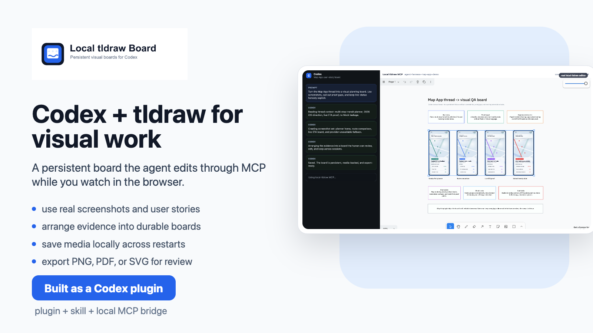
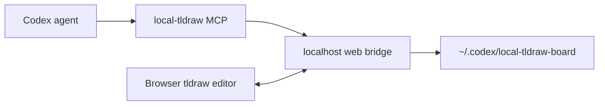

# Local tldraw Board for Codex

Persistent local tldraw boards that Codex can edit through MCP while you watch in the browser.

Use it when you want an agent to arrange screenshots, annotate a UI review, build a visual spec sheet, or keep an editable whiteboard alive across Codex restarts.



## What It Includes

- A local tldraw web app at `http://127.0.0.1:4876/?board=<board-id>`.
- A `local-tldraw` MCP server that executes edits against the live browser editor.
- Durable board snapshots in `~/.codex/local-tldraw-board/boards`.
- Persistent media storage in `~/.codex/local-tldraw-board/media`.
- Export helpers for PNG/SVG-style board output.
- A Codex skill that teaches the agent the setup, recovery, and visual verification workflow.

## Demo

See [`local-tldraw-board-demo.mp4`](./plugins/local-tldraw-board/assets/local-tldraw-board-demo.mp4).

## Install In Codex

In Codex Desktop:

1. Open `Plugins`.
2. Use the top-right menu to add a plugin marketplace.
3. Fill the marketplace form like this:

```text
Source: human-bee/local-tldraw-board
Git ref: main
Sparse paths:
.agents/plugins
plugins/local-tldraw-board
```

4. Add the marketplace.
5. Open the new `Local tldraw Board` marketplace entry.
6. Install and enable `Local tldraw Board`.

You can also add the marketplace from the Codex CLI:

```bash
codex plugin marketplace add human-bee/local-tldraw-board --ref main --sparse .agents/plugins --sparse plugins/local-tldraw-board
```

After installing the plugin, restart Codex if prompted.

## First Run

From the installed plugin root:

```bash
node scripts/setup.mjs
node scripts/install-launch-agent.mjs
node scripts/open-board.mjs my-board
```

For a one-off session without the macOS LaunchAgent:

```bash
node scripts/setup.mjs
node scripts/start-web.mjs
```

Then open:

```text
http://127.0.0.1:4876/?board=my-board
```

## Example Prompts

```text
Open a local tldraw board called design-review and put these screenshots in a clean comparison layout.
```

```text
Use local-tldraw to create a vertical spec sheet with each mockup, notes, implementation difficulty, and open questions.
```

```text
Export the current board as a PNG and show me the file.
```

## How It Works

The browser owns the real tldraw editor. The MCP server talks to the local web bridge, which sends JavaScript to the connected browser editor for the selected board. This makes edits visible immediately while keeping the board state local and durable.



## Troubleshooting

- `ERR_CONNECTION_REFUSED`: run `node scripts/start-web.mjs` or reinstall the LaunchAgent with `node scripts/install-launch-agent.mjs`.
- `No browser editor is connected`: open `http://127.0.0.1:4876/?board=<board-id>` before asking Codex to edit.
- Blank images after restart: run `node scripts/migrate-media.mjs`, restart the web bridge, and reload the board.
- Missing dependencies on a new machine: rerun `node scripts/setup.mjs`.

## Privacy

This plugin is local-first. Board snapshots, media, and exports are stored on your machine under `~/.codex/local-tldraw-board` unless you explicitly move or publish them. Do not put secrets on boards.

## Development

```bash
cd plugins/local-tldraw-board
node scripts/setup.mjs
npm --prefix assets/service run check
node scripts/healthcheck.mjs
```

## License

MIT
